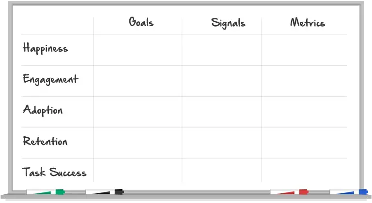

# HEART фреймворк

*Credit: http://www.dtelepathy.com/ux-metrics/*
---
- Категории, используемые для помощи в определении метрик
- Постарайтесь иметь несколько показателей в каждой категории

1. Счастье [**Happiness**]: показатели отношения пользователей, часто собираемые с помощью опросов. Например: удовлетворенность, кажущаяся простота использования и NPS.
2. Вовлеченность [**Engagement**]: уровень вовлеченности пользователей, обычно измеряемый с помощью поведенческих показателей, таких как частота, интенсивность или глубина взаимодействия за определенный период времени. Примеры могут включать количество посещений на пользователя в неделю или количество фотографий, загруженных на пользователя в день.
3. Принятие [**Adoption**]: новые пользователи продукта или функции. Например: количество учетных записей, созданных за последние семь дней, или процент пользователей Gmail, использующих ярлыки.
4. Удержание [**Retention**]: скорость, с которой существующие пользователи возвращаются. Например: сколько активных пользователей из данного периода времени все еще присутствует в какой-то более поздний период времени? Возможно, вас больше интересует неспособность удержать клиентов, широко известная как «отток».
5. Успех задачи [**Task success**]: сюда входят традиционные поведенческие показатели пользовательского опыта, такие как эффективность (например, время на выполнение задачи), результативность (например, процент выполненных задач) и частота ошибок. Эта категория наиболее применима к областям вашего продукта, которые очень ориентированы на задачи, таким как поиск или флоу загрузки.
---
### Источник
Фреймворк HEART был создан в Google и разработан в то время ведущим исследователем UX компании **Керри Родденом**. (Позже Родден перешел на должность исследователя UX на YouTube)

### Что почитать
https://medium.com/gv-library/how-to-choose-the-right-ux-metrics-for-your-product-5f46359ab5be